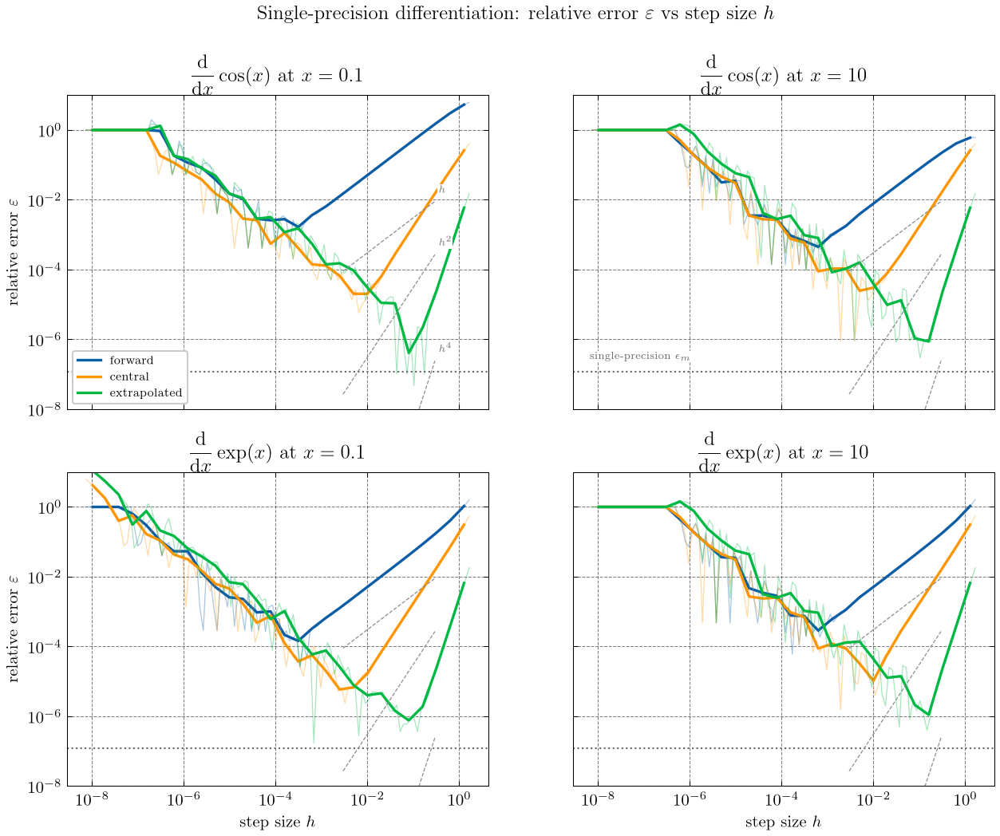
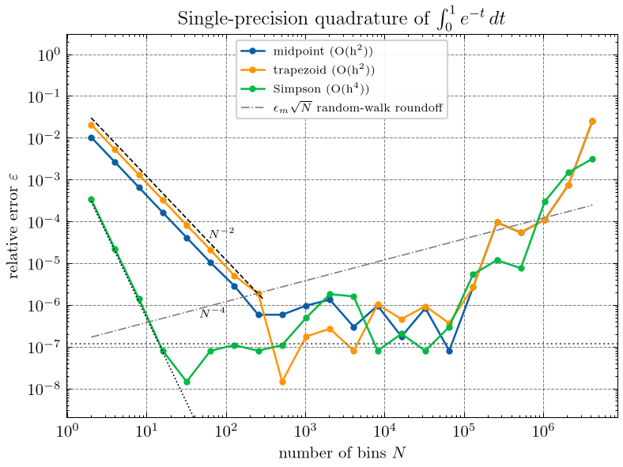
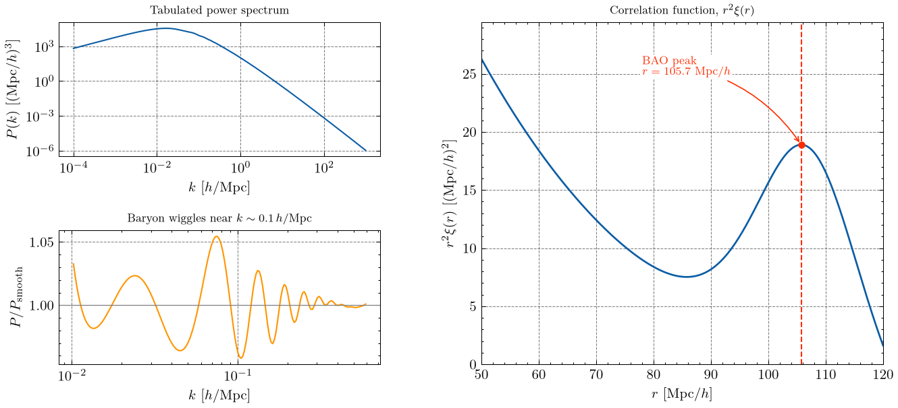

# Computational Physics — Homework 1

Numerical differentiation, quadrature, and the baryon acoustic oscillation (BAO)
peak in the matter correlation function.

## Running

The project uses [uv](https://docs.astral.sh/uv/). Figures use
[SciencePlots](https://github.com/garrettj403/SciencePlots); real LaTeX text
rendering is used automatically when `latex` and `dvipng` are installed, and
falls back to matplotlib mathtext otherwise.

```
uv sync
uv run python problem1.py
uv run python problem2.py
uv run python problem3.py
```

Figures are written to `figs/`.

| file | contents |
| --- | --- |
| `plotstyle.py` | shared SciencePlots configuration |
| `problem1.py` | forward / central / extrapolated differences in single precision |
| `problem2.py` | midpoint / trapezoid / Simpson quadrature in single precision |
| `problem3.py` | spline interpolation of P(k), the Fourier integral, and the BAO peak |
| `lcdm_z0.matter_pk` | supplied power spectrum (columns: k, P(k), ...) |

---

## Problem 1 — differentiation of cos(x) and exp(x) at x = 0.1, 10

All arithmetic inside the difference formulas is `float32`, so the machine
epsilon is 1.19e-07. Step sizes are powers of two, which are exactly
representable, so h itself contributes no rounding. The thin lines in the figure
are the raw point-to-point results; the thick lines are the median in log-h bins,
which is the trend under the roundoff noise.



### (b) scaling and significant digits

Balancing truncation error against a roundoff error of order eps_m / h gives

| method | truncation | h_opt | best relative error | significant digits |
| --- | --- | --- | --- | --- |
| forward | O(h) | eps_m^(1/2) = 3.4e-04 | eps_m^(1/2) = 3.4e-04 | ~3.5 |
| central | O(h^2) | eps_m^(1/3) = 4.9e-03 | eps_m^(2/3) = 2.4e-05 | ~4.6 |
| extrapolated | O(h^4) | eps_m^(1/5) = 4.1e-02 | eps_m^(4/5) = 2.9e-06 | ~5.5 |

The measured minima (see the table printed by `problem1.py`) sit at
h ~ 1e-4 for the forward difference, h ~ few times 1e-3 for the central
difference, and h ~ 1e-1 for the extrapolated one, matching the estimates. The
measured errors reach 1e-4 to 1e-5 (forward), 1e-6 (central) and a few times
1e-7 (extrapolated), i.e. 4, 6 and 7 significant digits. They land a little
below the estimates above because the estimate uses the worst-case roundoff
eps_m rather than the actual cancellation, which partly averages out.

The left-hand slopes in the figure follow the guide lines h, h^2 and h^4, which
confirms the order of each formula.

### (c) the two regimes

* **Large h (right of the minimum): truncation.** The error falls as h, h^2 and
  h^4 for the three methods. This regime is deterministic and smooth.
* **Small h (left of the minimum): roundoff.** Subtracting two nearly equal
  numbers loses digits, and the difference is divided by h, so the error rises
  as eps_m / h with a factor of 10 per decade. The curves become noisy because
  the cancellation error depends erratically on the last bits of f(x±h).
* **h below ~1e-7:** x + h rounds back to x in single precision, the numerator
  becomes exactly zero, and the relative error saturates at 1 (the plateau at
  the far left).
* The crossover moves right for higher-order methods, which is why the
  extrapolated difference is both the most accurate and the least demanding on
  step size.

---

## Problem 2 — quadrature of I = ∫₀¹ exp(−t) dt = 1 − 1/e

Sums are accumulated left to right in `float32` with a naive running total, so
roundoff accumulates the way it would in a hand-written loop.



### (b) and (c) what the plot shows

* **Small N: truncation.** Midpoint and trapezoid both fall as N^-2 and lie on
  top of each other, since their leading error terms differ only by the factor
  −1/2. Simpson falls as N^-4 and is already at the 1e-8 level by N ≈ 32.
* **Intermediate N: the single-precision floor.** Every method flattens out
  near eps_m ≈ 1.2e-07. Once the truncation error drops below the precision of
  the accumulated sum, adding bins buys nothing. Simpson hits this wall at
  N ~ 30, the second-order rules at N ~ few hundred.
* **Large N: roundoff growth.** Beyond N ~ 1e5 the error rises again. The
  reference line eps_m * sqrt(N) is the random-walk expectation for accumulating
  N rounding errors; the measured growth is somewhat steeper because the node
  positions t = a + i*h also lose precision as i grows in float32.
* **Best achievable accuracy is the same for all three methods** at roughly
  1e-8 to 1e-7 relative error, about seven significant digits. Simpson simply
  gets there with far fewer function evaluations.

Best results found:

| method | order | N at minimum | minimum relative error |
| --- | --- | --- | --- |
| midpoint | O(h^2) | 65536 | 8.0e-08 |
| trapezoid | O(h^2) | 512 | 1.5e-08 |
| Simpson | O(h^4) | 32 | 1.5e-08 |

---

## Problem 3 — the BAO peak

ξ(r) = (1 / 2π²) ∫ dk k² P(k) sin(kr) / (kr)

P(k) is interpolated with a cubic spline in log-log space, which respects its
power-law behaviour. The integral is split at k = 0.01 h/Mpc: below the split
the integrand is smooth and a logarithmic grid is used, above it a linear grid
with Δk = 2e-4 h/Mpc resolves the sin(kr) oscillations (the shortest period at
r = 120 Mpc/h is 2π/r ≈ 0.05 h/Mpc, so each oscillation carries ~260 points).
Composite Simpson is applied on each grid. P(k) is set to zero outside the
tabulated range, consistent with P(0) = 0.

A hard cut at k_max rings in configuration space with period 2π/k_max. A
Gaussian taper exp(−(k/k_damp)²) with k_damp = 3 h/Mpc removes the ringing while
smoothing ξ only on scales of order 1/k_damp ≈ 0.3 Mpc/h, far below the ~10
Mpc/h width of the bump.



### Robustness of the upper limit

| k_max [h/Mpc] | Δk | taper | r_peak [Mpc/h] |
| --- | --- | --- | --- |
| 1 | 2e-4 | none | 103.77 |
| 2 | 2e-4 | none | 105.26 |
| 5 | 2e-4 | none | 106.18 |
| 10 | 2e-4 | none | 105.87 |
| 20 | 2e-4 | none | 105.71 |
| 10 | 1e-4 | 3.0 | 105.73 |
| 10 | 5e-4 | 3.0 | 105.73 |
| 10 | 2e-4 | 1.0 | 105.69 |
| 10 | 2e-4 | 3.0 | 105.73 |
| 20 | 2e-4 | 3.0 | 105.73 |

Past k_max ≈ 5 h/Mpc the peak position is stable to better than 0.5 Mpc/h, and
halving or doubling Δk changes nothing, so k_max = 10 h/Mpc with Δk = 2e-4 is
converged. Truncating at k_max = 1 h/Mpc is visibly not.

### Result

**The BAO peak sits at r = 105.7 Mpc/h**, where r²ξ(r) = 18.9 (Mpc/h)².

Note that r²ξ(r) is still falling steeply at r = 50 Mpc/h and has dropped again
by r = 120, so the peak of the bump is an interior local maximum, not the
largest value in the plotted range. The code locates it as the most prominent
interior maximum and refines the position with a parabola through the top three
samples. The tabulated ξ(r) is written to `xi_of_r.txt`.
